# @adrianlynch/clingon

Generate tiny deterministic terminal characters.

100% created by AI. Use at your own risk. Obviously.

Each clingon is created from a readable name. Save the name and you can render the same character again later, or keep the same shape and generate a new set of colors.

```txt
      ##      
  [][][]    
[][]. []. [][]
[][][][][][][]
  []# [] #[]  
  . .    . .  
```

**Jump to:** [Install ↓](#install) · [Animation](#animation) · [JavaScript API](#javascript-api) · [Custom moves](#custom-moves)

## Screenshots

<p>
  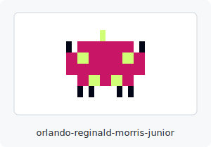
  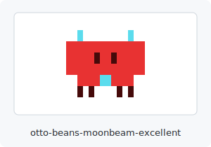
</p>
<p>
  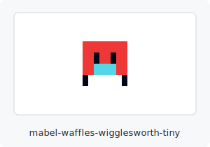
  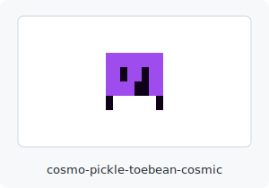
</p>

## Sizes

<p>
  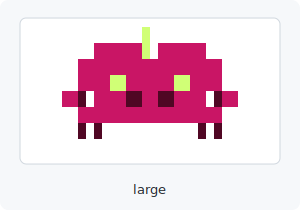
  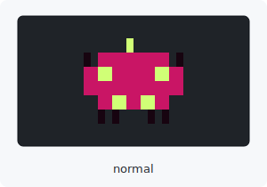
</p>
<p>
  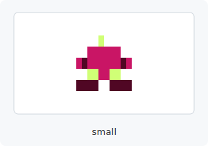
  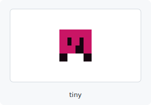
</p>

Terminal dimensions are `large` 22x8, `normal` 14x6, `small` 10x5, and `tiny` 8x4.

## Animation

<p>
  
</p>

Animate the creature in place — bob, blink, look, wiggle, walk. Loops until Ctrl-C.

```sh
clingon --animate --tiny
```

Animation requires a TTY. Piping to a file or another command writes a single static frame and exits.

### More options

Pick which behaviors run, change pacing, run for a finite duration, or combine with info-panel flags:

```sh
clingon --animate --moves idle,blink --tiny             # only the listed behaviors
clingon --animate --moves walk --in-sequence --tiny     # play behaviors in order, looping
clingon --animate --tiny --once                         # one cycle then exit
clingon --animate --tiny --seconds 5                    # finite duration
clingon --animate --tiny --fps 12                       # animation speed (1-30, default 8)
clingon --animate --large --welcome --date --git --pad=1
```

Behaviors layer on a single timeline by default — bob runs continuously while blinks, looks, wiggles, and walks fire as random events. `--in-sequence` plays the listed moves one-at-a-time in a loop instead.

### Deterministic rhythm

Animation rhythm is derived from the name — the same name always produces the same pattern of bobs and blinks. Add an optional 5th word for explicit rhythm control:

```sh
clingon --animate --with-name orlando-reginald-morris-junior --tiny           # rhythm derived
clingon --animate --with-name orlando-reginald-morris-junior-bouncy --tiny    # explicit rhythm
clingon --animate --with-name orlando-reginald-morris-junior-snoozy --tiny    # different rhythm, same creature
```

## More examples

Animation on its own — bob, blink, look, wiggle, walk on a single timeline:

```sh
clingon --animate
```

<p>
  
</p>

A custom message beside the art:

```sh
clingon --tiny --message "Ready"
```

<p>
  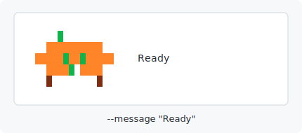
</p>

A time-aware greeting and current directory, with one line of padding around the output:

```sh
clingon --tiny --welcome --cwd --pad=1
```

<p>
  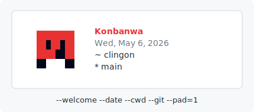
</p>

The same creature with a different palette — `--recolor` keeps the shape from the name and rerolls just the colors:

```sh
clingon --with-name orlando-reginald-morris-junior --recolor
```

<p>
  
  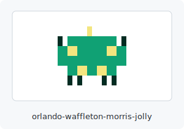
</p>

## Inline mode

Render a compact single-line glyph for statuslines, prompts, and tmux status bars.

```sh
clingon --inline --tiny --with-name orlando-reginald-morris-junior
```

<p>
  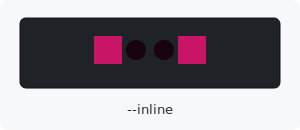
</p>

Output is one line, width matching the size (4 chars for tiny, up to 11 for large). See [docs/integrations.md](docs/integrations.md) for tmux, starship, oh-my-posh, and Claude Code examples.

## Discovery

Browse a grid of random creatures with their names — useful for picking one to save:

```sh
clingon --gallery               # 8 random clingons (default)
clingon --gallery 12 --tiny     # 12 tiny ones, more per row
clingon --gallery --animate     # animated grid, all moving at once
```

List all the words you can compose names from:

```sh
clingon --list-names
```

Names are 4 hyphen-separated words by default (`<first>-<middle>-<family>-<suffix>`). The 1st and 3rd words drive the shape; the 2nd and 4th drive the palette. An optional 5th word picks an animation rhythm. Use `*` as a wildcard in any slot:

```sh
clingon --with-name orlando-*-morris-*           # fix shape, random palette
clingon --with-name *-reginald-*-junior          # fix palette, random shape
clingon --with-name orlando-*-morris-*-bouncy    # fix shape and rhythm
```

## Install

Install with Homebrew and add clingon to `~/.zshrc`:

```sh
curl -fsSL https://raw.githubusercontent.com/adrianlynch/clingon/main/install.sh | sh
```

Install only, without changing `~/.zshrc`:

```sh
curl -fsSL https://raw.githubusercontent.com/adrianlynch/clingon/main/install.sh | sh -s -- --no-zshrc
```

Choose the startup size:

```sh
curl -fsSL https://raw.githubusercontent.com/adrianlynch/clingon/main/install.sh | sh -s -- --small --welcome --date --cwd --git --pad-v=1
```

Customize the generated `~/.zshrc` command by passing clingon options:

```sh
curl -fsSL https://raw.githubusercontent.com/adrianlynch/clingon/main/install.sh | sh -s -- --tiny --message "Good morning" --date --git --pad-v=1
```

Install with npm:

```sh
npm install @adrianlynch/clingon
```

Install with Homebrew:

```sh
brew install adrianlynch/tap/clingon
```

Run it without installing:

```sh
npx @adrianlynch/clingon --small
```

## Use In zsh

Install it globally so shell startup does not need to run `npx`:

```sh
npm install -g @adrianlynch/clingon
```

Add this to `~/.zshrc` to show a random tiny clingon in each terminal:

```sh
clingon --tiny --pad=1
```

Use a saved name for the same startup clingon every time:

```sh
clingon --with-name orlando-reginald-morris-junior --tiny --pad=1
```

Show welcome text and local context beside it:

```sh
clingon --with-name orlando-reginald-morris-junior --tiny --welcome --date --cwd --git --pad=1
```

`--welcome` picks a time-aware greeting from English, Spanish, or romanized Japanese.
Clingon names are hidden by default. Add `--name` where you want the name to appear beside it.
`--pad=1` adds a blank line above and below the character plus one space of left padding.

## CLI

Generate a random clingon:

```sh
clingon
```

Generate a compact clingon:

```sh
clingon --small
```

Generate a tiny four-line clingon:

```sh
clingon --tiny
```

Regenerate a specific clingon:

```sh
clingon --with-name orlando-reginald-morris-junior
```

Keep the same shape, but choose a new random palette:

```sh
clingon --with-name orlando-reginald-morris-junior --recolor
```

Print the JavaScript needed to recreate the same clingon:

```sh
clingon --with-name orlando-reginald-morris-junior --small --script
```

Print structured output:

```sh
clingon --small --json
```

Show up to five lines of text beside the clingon:

```sh
clingon --tiny --name
clingon --tiny --welcome
clingon --tiny --message "Ready"
clingon --tiny --date --cwd --git
clingon --tiny --git --message "Ready" --name
```

`--cwd` is shown as `~ directory-name`, and `--git` is shown as `* branch-name`.
Label flags are shown in the order you pass them.

Add space around terminal output:

```sh
clingon --tiny --pad=1
clingon --tiny --pad-h=2 --pad-v=1
```

## Options

```txt
clingon

Usage:
  clingon [options]

  *-- Identity ---------------------------------------------------------------
    -w, --with-name <name>  Regenerate a specific clingon. 4 or 5 hyphen-separated
                            words: <first>-<middle>-<family>-<suffix>[-<rhythm>].
                            Use '*' as a wildcard for any slot to randomize it.
                            Examples:
                              orlando-*-morris-*           fix shape, random palette
                              *-reginald-*-junior          fix palette, random shape
                              orlando-*-morris-*-bouncy    fix shape and rhythm
                              *-*-*-*-*                    fully random 5-word
    -r, --recolor           Keep the shape from --with-name but choose new colors

  *-- Size -------------------------------------------------------------------
        --tiny              4x4 grid
        --small             5x5 grid
        --normal            7x6 grid (default)
        --large             11x8 grid

  *-- Output mode (mutually exclusive) -----------------------------------------
    -i, --inline            Single-line glyph (for statuslines, prompts)
    -j, --json              JSON output
    -s, --script            Print the JS code that recreates this clingon
    -g, --gallery [n]       Show n random clingons (default 8) with their names,
                            laid out as a grid that auto-fits the terminal width.
                            Combine with --animate to see them all moving.
        --list-names        Print the available word lists for composing names

  *-- Animation --------------------------------------------------------------
    -a, --animate           Animate the creature in place. Loops until Ctrl-C.
                            The flags below all require --animate.
        --moves <list>      Comma-separated list of behaviors. Built-ins:
                            idle, blink, look, wiggle, walk.
                            Default: idle,blink,look,wiggle,walk.
                            For custom moves, use the JavaScript API.
        --in-sequence       Play behaviors in order vs. layered (default: layered)
        --once              Play one full animation cycle and exit
        --fps <n>           Animation frames per second (1-30). Default 8.
        --seconds <n>       Run animation for N seconds then exit

  *-- Info panel -------------------------------------------------------------
    -n, --name              Show the clingon's name beside the art
        --welcome           Show a time-aware greeting beside the art
        --message <msg>     Show a custom message beside the art
        --date              Show today's date beside the art
        --cwd               Show the current directory beside the art
        --git               Show the current git branch beside the art

  *-- Padding ----------------------------------------------------------------
    -p, --pad <n>           Add padding around terminal output
        --pad-h <n>         Add spaces before each terminal output line
        --pad-v <n>         Add blank lines before and after terminal output

  *-- Style ------------------------------------------------------------------
        --no-color          Render without ANSI color
    -l, --light             Use a darker palette tuned for light terminals

  *-- Other ------------------------------------------------------------------
    -h, --help              Show help
    -v, --version           Show version
```

## JavaScript API

```js
import { generateClingon } from '@adrianlynch/clingon';

const clingon = generateClingon({
  name: 'orlando-reginald-morris-junior',
  size: 'tiny'
});

console.log(clingon.ansi);
console.log(clingon.name);
```

Random clingon:

```js
import { generateClingon } from '@adrianlynch/clingon';

const clingon = generateClingon();
console.log(clingon.ansi);
```

Render-only helper:

```js
import { renderClingon } from '@adrianlynch/clingon';

console.log(renderClingon({
  name: 'orlando-reginald-morris-junior',
  size: 'tiny'
}));
```

## Returned Data

`generateClingon()` returns:

```js
{
  name: 'orlando-reginald-morris-junior',
  code: 'orlando-reginald-morris-junior',
  size: 'tiny',
  shapeSeed: 0,
  paletteSeed: 0,
  rhythmSeed: null,            // set when name has a 5th rhythm word
  palette: {
    body: '#f06a0d',
    accent: '#2bce67',
    dark: '#7c2d12'
  },
  pixels: [[0, 0, 0]],
  ansi: '...',
  text: '...',
  inline: '[oo['               // single-line render for statuslines
}
```

Names are 4 or 5 hyphen-separated words:

- 1st (first) and 3rd (family) → shape
- 2nd (middle) and 4th (suffix) → palette
- 5th (rhythm, optional) → animation timing

Older `clg-...` seed codes are still accepted via the JavaScript API:

```js
generateClingon({ code: 'clg-00000rs-00000rt' });
```

## Custom moves

Built-in moves cover most uses. For custom animations, use the JavaScript API:

```js
import { animateClingon, defineMove, blink, bob, frame } from '@adrianlynch/clingon';

defineMove('peek', {
  sequence: (basePixels) => [
    frame(bob(basePixels, 1), 6),
    frame(bob(basePixels, 0), 3),
    frame(blink(bob(basePixels, 0)), 1),
    frame(bob(basePixels, 0), 4)
  ]
});

await animateClingon({
  name: 'orlando-reginald-morris-junior',
  size: 'tiny',
  frames: ['peek'],
  mode: 'sequence',
  seconds: 5
}).done;
```

Built-in mutators take a pixel grid and return a transformed one — `blink`, `bob`, `wiggle`, `walk`, `lookLeft`, `lookRight`. Each `frame(pixels, duration)` becomes one entry in the sequence.

For transformations the built-ins don't cover, `mapCells(pixels, mapper)` lets you rewrite cells by stable string kind (`'body'`, `'eye-dark-left'`, etc.) without depending on internal cell-ID numbers:

```js
import { mapCells } from '@adrianlynch/clingon';

// Replace eyes with body cells (a manual blink, the long way).
const closed = mapCells(basePixels, ({ kind }) => (
  kind.startsWith('eye-') ? 'body' : null
));
```

The full kind list is exported as `CELL_KINDS`. See [docs/examples/custom-moves.js](docs/examples/custom-moves.js) for a runnable example.

## Development

```sh
npm test
npm start -- --small
npm run docs:assets
npm pack --dry-run
```
